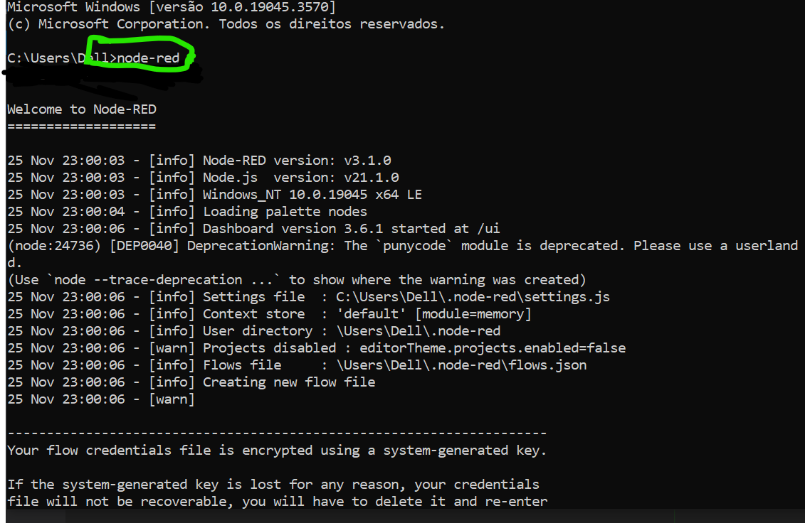
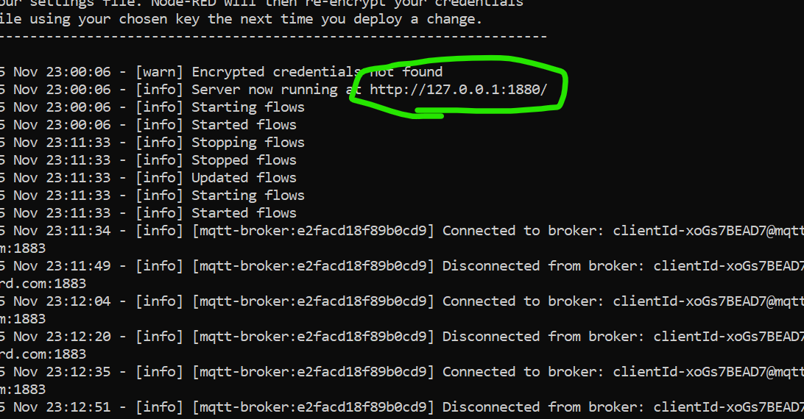
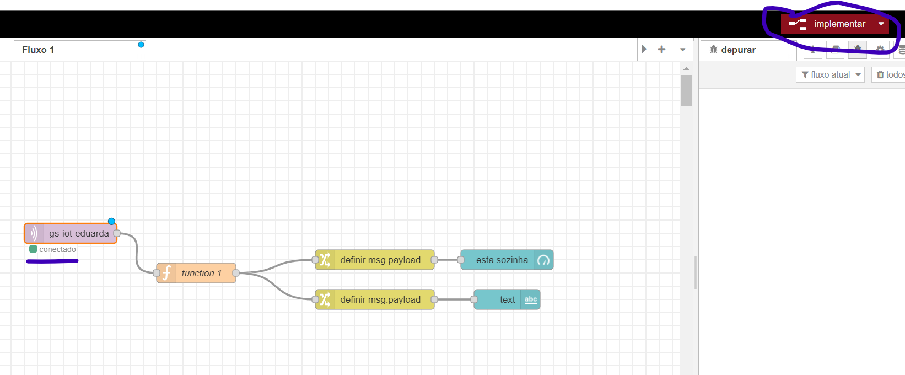
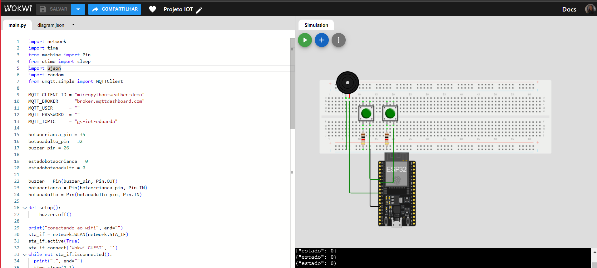
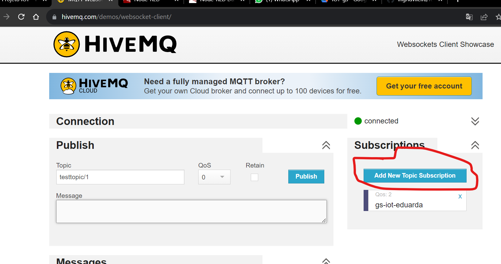
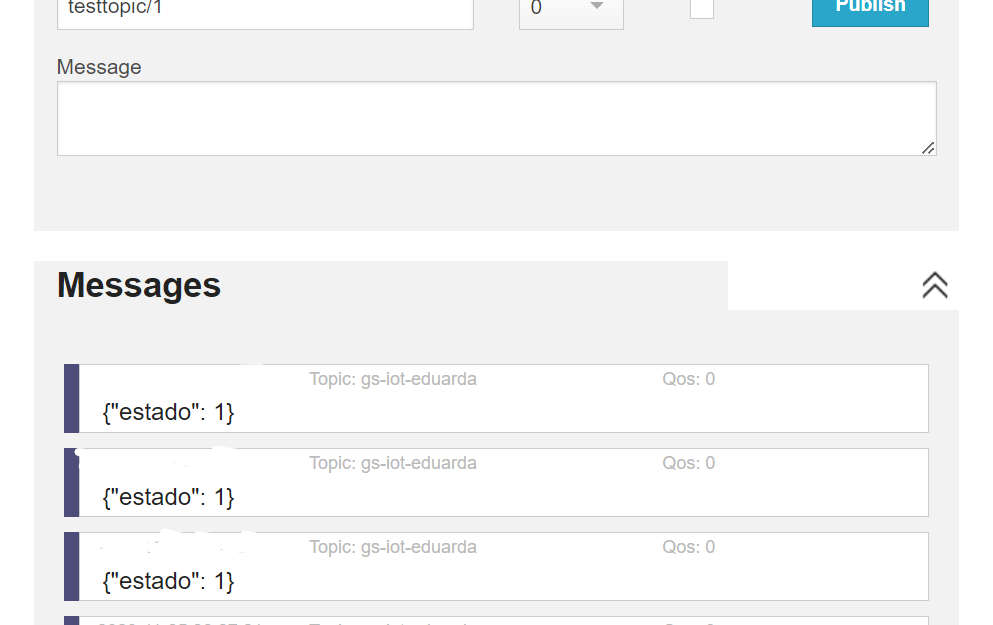

# IOT-gs Localhealth

## Integrantes:
RM95854 - Eduarda Nicoli Cavalheiro --2TDSPG
RM95396 - Ingrid Vieira de Oliveira --2TDSPG
RM93535 - Erik Siarkowski Salafia --2TDST

## Descrição do Projeto Localhealth
Essa ideia propõe a implementação de um sistema IOT em veículos, utilizando a  Raspberry Pi (32). A concepção é que, ao pressionar os bancos do carro (simbolizados por botões nas imagens), a  Raspberry interpreta a presença de adultos no veículo. Se não detectar a presença de adultos, o sistema deduz que há uma criança sozinha no carro e emite um alerta sonoro no veículo ou no celular do proprietário, servindo como um lembrete importante para evitar situações potencialmente perigosas. Esse projeto visa a segurança das crianças, alertando os pais ou responsáveis sobre a presença delas no carro quando nenhum adulto está presente.

## Como rodar o projeto

### 1- Vamos iniciar o node-red
Abra o cmd (Prompt de Comando)do seu computador e digine node-red

logo após va para baixo no cmd e pegue o link para acessar o node red no navegador

Link do node-red: http://127.0.0.1:1880/

Vamos esportar o flowsNodeRed para dentro do nodeRed

Se precisar instala a biblioteca do node-red-dashboard

### 2- Abra o link em um navegador
Link: https://wokwi.com/projects/382426100994756609
ps: esteje conectado a internet

Se quiser pode rodar 

### 3-Vamos entrar no site para ver se o MQTT está funcionando 
abra este link: https://www.hivemq.com/demos/websocket-client/
 Aperte em no Add New Topic Subscription e escreva gs-iot-eduarda
 
 Logo após você verá as informações aparece
 

 ### 4- Volte no node-red (navegador) com o simulador ja funcionando, vamos implementar os nós do node
 Aperte em implementar
 

 Abra o http://127.0.0.1:1880/ui para ver o dashboard funcionando

E pronto agora é só apertar os botões no simulador.

Lembrando que o primeniro botão, é botão de estado, então se vc apertar uma vez vai estar constando como 1 e
quer dizer que não tem adulto com criança no carro. Se você aperta-lo novamente vai constar que tem adulto no carro

E o outro botão é para apertar pra falar quando tem criança no carro, mas não é de estado como o outro.

